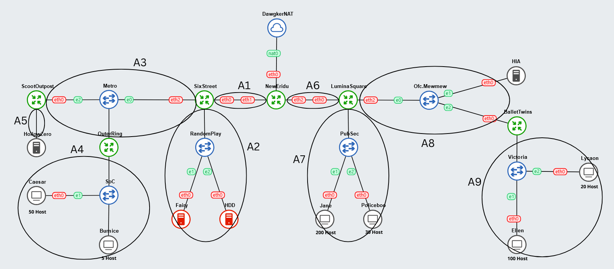

# Jarkom-Modul-5-IT21-2024

|Nama  | NRP |
|--|--|
| Nathan Kho Pancras | 5027231002 |
| Muhammad Andrean Rizq Prasetio | 5027231052 |
****
## Daftar Isi

- [Jarkom-Modul-5-IT21-2024](#jarkom-modul-5-it21-2024)
	- [Daftar Isi](#daftar-isi)
- [Misi 1: Memetakan Kota New Eridu](#misi-1-memetakan-kota-new-eridu)
	- [Soal 1: Topologi \& Subnetting](#soal-1-topologi--subnetting)
	- [Soal 2: VLSM](#soal-2-vlsm)
		- [Detail Subnetting](#detail-subnetting)
		- [Pembagian IP](#pembagian-ip)
	- [Soal 3: Set IP \& Routing](#soal-3-set-ip--routing)
		- [Set IP](#set-ip)
		- [Routing](#routing)
	- [Soal 4: Konfigurasi](#soal-4-konfigurasi)
		- [DNS Server - dnsserv.sh](#dns-server---dnsservsh)
		- [DHCP Relay - dhcprelay.sh](#dhcp-relay---dhcprelaysh)
		- [DHCP Server - dhcpserv.sh](#dhcp-server---dhcpservsh)
		- [Webserver - webserv.sh](#webserver---webservsh)
- [Misi 2: Menemukan Jejak Sang Peretas](#misi-2-menemukan-jejak-sang-peretas)
	- [Soal 1: Set iptables](#soal-1-set-iptables)
	- [Soal 2](#soal-2)
	- [Soal 3](#soal-3)
	- [Soal 4](#soal-4)
	- [Soal 5](#soal-5)
	- [Soal 6](#soal-6)
	- [Soal 7](#soal-7)
	- [Soal 8](#soal-8)
- [Misi 3: Menangkap Burnice](#misi-3-menangkap-burnice)
	- [Soal 1](#soal-1)


# Misi 1: Memetakan Kota New Eridu

## Soal 1: Topologi & Subnetting

> Sebuah topologi sederhana menggambarkan jaringan New Eridu:

```
Keterangan:
    HDD: Berfungsi sebagai DNS Server.
    Fairy: Berfungsi sebagai DHCP Server.
    Web Servers: HIA, HollowZero.
    Client:
        Burnice: Memiliki 5 host.
        Lycaon: Memiliki 20 host.
        Policeboo: Memiliki 30 host.
        Caesar: Memiliki 50 host
        Ellen: Memiliki 100 host.
        Jane: Memiliki 200 host.
```



## Soal 2: VLSM

> Setelah membagi alamat IP menggunakan VLSM, gambarkan pohon subnet yang menunjukkan hierarki pembagian IP di jaringan New Eridu. Lingkari subnet-subnet yang akan dilewati dalam jaringan.

### Detail Subnetting

| Nama Subnet | Rute | Jumlah IP | Netmask |
|-------------|------|-----------|---------|
| A1          | NewEridu > SixStreet | 2 | /30 |
| A2          | NewEridu > SixStreet > RandomPlay > Fairy / HDD | 3 | /29 |
| A3          | NewEridu > SixStreet > Metro > ScootOutpost / OuterRing | 3 | /29 |
| A4          | NewEridu > SixStreet > Metro > OuterRing > SoC > Burnice / Caesar | 56 | /26 |
| A5          | NewEridu > SixStreet > Metro > ScootOutpost > HollowZero | 2 | /30 |
| A6          | NewEridu > LuminaSquare | 2 | /30 |
| A7          | NewEridu > LuminaSquare > PubSec > Jane / Policeboo | 231 | /24 |
| A8          | NewEridu > LuminaSquare > Ofc.Mewmew > HIA / BalletTwins | 3 | /29 |
| A9          | NewEridu > LuminaSquare > Ofc.Mewmew > BalletTwins > Victoria > Lycaon / Ellen | 121 | /25 |
| **Total**   |      | **423**   | **/23** |

### Pembagian IP

| Subnet | Network ID       | Netmask           | Broadcast       | Range IP                     |
|--------|-------------------|-------------------|-----------------|------------------------------|
| A1     | 10.74.1.220     | 255.255.255.252   | 10.74.1.223   | 10.74.1.221 - 10.74.1.222|
| A2     | 10.74.1.200     | 255.255.255.248   | 10.74.1.207   | 10.74.1.201 - 10.74.1.206|
| A3     | 10.74.1.208     | 255.255.255.248   | 10.74.1.215   | 10.74.1.209 - 10.74.1.214|
| A4     | 10.74.1.128     | 255.255.255.192   | 10.74.1.191   | 10.74.1.129 - 10.74.1.190|
| A5     | 10.74.1.224     | 255.255.255.252   | 10.74.1.227   | 10.74.1.225 - 10.74.1.226|
| A6     | 10.74.1.216     | 255.255.255.252   | 10.74.1.219   | 10.74.1.217 - 10.74.1.218|
| A7     | 10.74.0.0       | 255.255.255.0     | 10.74.0.255   | 10.74.0.1 - 10.74.0.254  |
| A8     | 10.74.1.192     | 255.255.255.248   | 10.74.1.199   | 10.74.1.193 - 10.74.1.198|
| A9     | 10.74.1.0       | 255.255.255.128   | 10.74.1.127   | 10.74.1.1 - 10.74.1.126  |

## Soal 3: Set IP & Routing

> Setelah pembagian IP selesai, buatlah konfigurasi rute untuk menghubungkan semua subnet dengan benar di jaringan New Eridu. Pastikan perangkat dapat saling terhubung.

**NOTE: Untuk konfigurasi IP dan routing dimasukkan ke /etc/network/interfaces atau di GNS3 > Select Node > Configure > Edit network configuation**

### Set IP

**NewEridu (Router)**

```bash
auto eth0
iface eth0 inet dhcp

# A1
auto eth1
iface eth1 inet static
	address 10.74.1.221
	netmask 255.255.255.252

# A6
auto eth2
iface eth2 inet static
	address 10.74.1.217
	netmask 255.255.255.252
```

**SixStreet (Router)**

```bash
# A1
auto eth0
iface eth0 inet static
	address 10.74.1.222
	netmask 255.255.255.252
	gateway 10.74.1.221

# A2
auto eth1
iface eth1 inet static
	address 10.74.1.201
	netmask 255.255.255.248

# A3
auto eth2
iface eth2 inet static
	address 10.74.1.209
	netmask 255.255.255.248
```

**Fairy (DHCP Server)**

```bash
# A2
auto eth0
iface eth0 inet static
	address 10.74.1.202
	netmask 255.255.255.248
	gateway 10.74.1.201
```

**HDD (DNS Server)**

```bash
# A2
auto eth0
iface eth0 inet static
	address 10.74.1.203
	netmask 255.255.255.248
	gateway 10.74.1.201
```

**OuterRing (Router)**

```bash
# A3
auto eth0
iface eth0 inet static
	address 10.74.1.210
	netmask 255.255.255.248
	gateway 10.74.1.209

# A4
auto eth1
iface eth1 inet static
	address 10.74.1.129
	netmask 255.255.255.192
```

**Burnice - 5 Host (Client)**

```bash
auto eth0
iface eth0 inet dhcp
```

**Caesar - 50 Host (Client)**

```bash
auto eth0
iface eth0 inet dhcp
```

**ScootOutpost (Router)**

```bash
# A3
auto eth0
iface eth0 inet static
	address 10.74.1.211
	netmask 255.255.255.248
	gateway 10.74.1.209

# A5
auto eth1
iface eth1 inet static
	address 10.74.1.225
	netmask 255.255.255.252
```

**HollowZero (Webserver)**

```bash
# A5
auto eth0
iface eth0 inet static
	address 10.74.1.226
	netmask 255.255.255.252
	gateway 10.74.1.225
```

**LuminaSquare (Router)**

```bash
# A6
auto eth0
iface eth0 inet static
	address 10.74.1.218
	netmask 255.255.255.252
	gateway 10.74.1.217

# A7
auto eth1
iface eth1 inet static
	address 10.74.0.1
	netmask 255.255.255.0

# A8
auto eth2
iface eth2 inet static
	address 10.74.1.193
	netmask 255.255.255.248
```

**Jane - 200 Host (Client)**

```bash
auto eth0
iface eth0 inet dhcp
```

**Policeboo - 30 Host (Client)**

```bash
auto eth0
iface eth0 inet dhcp
```

**HIA (Webserver)**

```bash
# A8
auto eth0
iface eth0 inet static
	address 10.74.1.195
	netmask 255.255.255.248
  	gateway 10.74.1.193
```

**BalletTwins (Router)**

```bash
# A8
auto eth0
iface eth0 inet static
	address 10.74.1.194
	netmask 255.255.255.248
  	gateway 10.74.1.193

# A9
auto eth1
iface eth1 inet static
  	address 10.74.1.1
	netmask 255.255.255.128
```

**Ellen - 100 Host (Client)**

```bash
auto eth0
iface eth0 inet dhcp
```

**Lycaon - 20 Host (Client)**

```bash
auto eth0
iface eth0 inet dhcp
```

### Routing

**NewEridu (Router)**

```bash
auto eth0
iface eth0 inet dhcp

# A1
auto eth1
iface eth1 inet static
	address 10.74.1.221
	netmask 255.255.255.252

# A6
auto eth2
iface eth2 inet static
	address 10.74.1.217
	netmask 255.255.255.252

# RIGHT
post-up route add -net 10.74.0.0 netmask 255.255.255.0 gw 10.74.1.218
post-up route add -net 10.74.1.192 netmask 255.255.255.248 gw 10.74.1.218
post-up route add -net 10.74.1.0 netmask 255.255.255.128 gw 10.74.1.218

# LEFT
post-up route add -net 10.74.1.200 netmask 255.255.255.248 gw 10.74.1.222
post-up route add -net 10.74.1.208 netmask 255.255.255.248 gw 10.74.1.222
post-up route add -net 10.74.1.128 netmask 255.255.255.192 gw 10.74.1.222
post-up route add -net 10.74.1.224 netmask 255.255.255.252 gw 10.74.1.222
```

**SixStreet (Router)**

```bash
# A1
auto eth0
iface eth0 inet static
	address 10.74.1.222
	netmask 255.255.255.252
	gateway 10.74.1.221

# A2
auto eth1
iface eth1 inet static
	address 10.74.1.201
	netmask 255.255.255.248

# A3
auto eth2
iface eth2 inet static
	address 10.74.1.209
	netmask 255.255.255.248

post-up route add -net 0.0.0.0 netmask 0.0.0.0 gw 10.74.1.221
post-up route add -net 10.74.1.128 netmask 255.255.255.192 gw 10.74.1.210 # A4
post-up route add -net 10.74.1.224 netmask 255.255.255.252 gw 10.74.1.211 # A5
```

**OuterRing (Router)**

```bash
# A3
auto eth0
iface eth0 inet static
	address 10.74.1.210
	netmask 255.255.255.248
	gateway 10.74.1.209

# A4
auto eth1
iface eth1 inet static
	address 10.74.1.129
	netmask 255.255.255.192

post-up route add -net 0.0.0.0 netmask 0.0.0.0 gw 10.74.1.209
post-up route add -net 10.74.1.224 netmask 255.255.255.252 gw 10.74.1.211 # A5
```

**ScootOutpost (Router)**

```bash
# A3
auto eth0
iface eth0 inet static
	address 10.74.1.211
	netmask 255.255.255.248
	gateway 10.74.1.209

# A5
auto eth1
iface eth1 inet static
	address 10.74.1.225
	netmask 255.255.255.252

post-up route add -net 0.0.0.0 netmask 0.0.0.0 gw 10.74.1.209
post-up route add -net 10.74.1.128 netmask 255.255.255.192 gw 10.74.1.210 # A4
```

**LuminaSquare (Router)**

```bash
# A6
auto eth0
iface eth0 inet static
	address 10.74.1.218
	netmask 255.255.255.252
	gateway 10.74.1.217

# A7
auto eth1
iface eth1 inet static
	address 10.74.0.1
	netmask 255.255.255.0

# A8
auto eth2
iface eth2 inet static
	address 10.74.1.193
	netmask 255.255.255.248

post-up route add -net 0.0.0.0 netmask 0.0.0.0 gw 10.74.1.217
post-up route add -net 10.74.1.0 netmask 255.255.255.128 gw 10.74.1.194 # A9
```

**BalletTwins (Router)**

```bash
# A8
auto eth0
iface eth0 inet static
	address 10.74.1.194
	netmask 255.255.255.248
 	gateway 10.74.1.193

# A9
auto eth1
iface eth1 inet static
  	address 10.74.1.1
	netmask 255.255.255.128

post-up route add -net 0.0.0.0 netmask 0.0.0.0 gw 10.74.1.192
```

## Soal 4: Konfigurasi

> Dikerjakan setelah Misi 2 Nomor 1:
>
>> Fairy sebagai DHCP Server agar perangkat yang berada dalam Burnice, Caesar, Ellen, Jane, Lycaon, dan Policeboo dapat menerima IP secara otomatis
>
>> OuterRing, BalletTwins, Sixstreet dan LuminaSquare Sebagai DHCP Relay
>
>> HDD sebagai DNS Server
>
>> HIA dan HollowZero sebagai Webserver (gunakan apache)

### DNS Server - dnsserv.sh

```bash
echo 'nameserver 192.168.122.1' > /etc/resolv.conf
apt-get update && apt-get install isc-dhcp-server -y

echo '
INTERFACESv4="eth0"
INTERFACESv6=""
' > /etc/default/isc-dhcp-server

echo '
# Jane & Policeboo 
subnet 10.74.0.0 netmask 255.255.255.0 {
  range 10.74.0.2 10.74.0.254;
  option routers 10.74.0.1;
  option broadcast-address 10.74.0.255;
  option domain-name-servers 10.74.1.203;
}
# Ellen & Lycaon 
subnet 10.74.1.0 netmask 255.255.255.128 {
  range 10.74.1.2 10.74.1.254;
  option routers 10.74.1.1;
  option broadcast-address 10.74.1.127;
  option domain-name-servers 10.74.1.203;
}
# Caesar & Burnice 
subnet 10.74.1.128 netmask 255.255.255.192 {
  range 10.74.1.130 10.74.1.190;
  option routers 10.74.1.129;
  option broadcast-address 10.74.1.191;
  option domain-name-servers 10.74.1.203;
}
' > /etc/dhcp/dhcpd.conf

service isc-dhcp-server restart
```

### DHCP Relay - dhcprelay.sh

```bash
echo 'nameserver 192.168.122.1' > /etc/resolv.conf
apt-get update && apt-get install isc-dhcp-relay -y

# IP Fairy: 10.74.1.202
echo '
SERVERS="10.74.1.202"
INTERFACES="eth0 eth1 eth2 eth3"
OPTIONS=""
' > /etc/default/isc-dhcp-relay

echo '
net.ipv4.ip_forward=1
' > /etc/sysctl.conf

service isc-dhcp-relay restart
```

### DHCP Server - dhcpserv.sh

```bash
echo 'nameserver 192.168.122.1' > /etc/resolv.conf
apt-get update && apt-get install bind9 -y

echo 'options {
    directory "/var/cache/bind";

    forwarders {
        192.168.122.1;
    };

    // dnssec-validation auto;

    allow-query { any; };
    auth-nxdomain no;    # conform to RFC1035
    listen-on-v6 { any; };
};' > /etc/bind/named.conf.options

service bind9 restart
```

### Webserver - webserv.sh

```bash
echo 'nameserver 192.168.122.1' > /etc/resolv.conf
apt-get update && apt-get install apache2 -y

echo "Welcome to $HOST" > /var/www/html/index.html

service apache2 restart
```

# Misi 2: Menemukan Jejak Sang Peretas

## Soal 1: Set iptables

> Agar jaringan di New Eridu bisa terhubung ke luar (internet), kalian perlu mengkonfigurasi routing menggunakan iptables. Namun, kalian tidak diperbolehkan menggunakan MASQUERADE.

**iptables.sh**

```bash
ETH0_IP=$(ip -4 addr show eth0 | grep -oP '(?<=inet\s)\d+(\.\d+){3}')
iptables -t nat -A POSTROUTING -o eth0 -j SNAT --to-source $ETH0_IP
```

## Soal 2

## Soal 3

## Soal 4

## Soal 5

## Soal 6

## Soal 7

## Soal 8

# Misi 3: Menangkap Burnice

## Soal 1